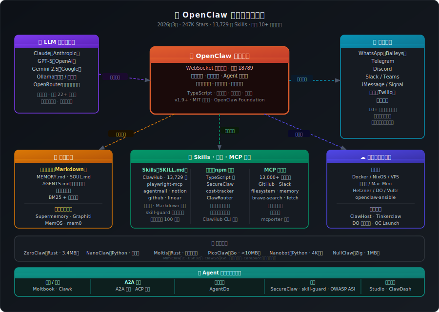

<div align="center">



# 🦞 Awesome OpenClaw

**精心策划的 OpenClaw 优质资源大合集 —— 不求大而全，只求真有用。**

*Skills · 插件 · MCP · 工具 · 部署 · 安全 · 研究 · 替代实现*

[](https://awesome.re)
[](CONTRIBUTING.md)
[](https://creativecommons.org/publicdomain/zero/1.0/)
[](https://github.com/openclaw/awesome-openclaw/commits/main)
[](https://github.com/EthanYolo01/Awesome-OpenClaw/actions)
[](https://github.com/EthanYolo01/Awesome-OpenClaw/stargazers)
[](https://github.com/EthanYolo01/Awesome-OpenClaw/graphs/contributors)

> **有观点的精选，而非无脑堆砌。**
> 每一条资源都经过人工审核。其他列表只给你一个链接，我们告诉你它*为什么*值得看、*什么情况下*该用它。

**OpenClaw 现状速览（2026 年 3 月）：** ⭐ 247K GitHub Stars &nbsp;·&nbsp; 🔱 47.7K Forks &nbsp;·&nbsp; 🧩 13,729 个 ClawHub Skills &nbsp;·&nbsp; 🌍 支持 10+ 消息平台

---

🌐 语言切换 / Language：**中文** | [English](README.md)

</div>

---

## 📋 目录

- [🏁 从这里开始 — OpenClaw 是什么？](#-从这里开始--openclaw-是什么)
- [⏳ 发展历程与里程碑](#-发展历程与里程碑)
- [🏠 官方资源](#-官方资源)
- [⚡ 快速上手与安装](#-快速上手与安装)
- [🧠 核心架构](#-核心架构)
- [🤖 LLM 模型选型指南](#-llm-模型选型指南)
- [💰 成本估算指南](#-成本估算指南)
- [🔧 Skills 与插件](#-skills-与插件)
- [🤖 MCP 集成](#-mcp-集成)
- [🖥️ 界面与配套应用](#️-界面与配套应用)
- [🌐 平台频道与消息集成](#-平台频道与消息集成)
- [☁️ 部署与基础设施](#️-部署与基础设施)
- [🏢 企业级部署](#-企业级部署)
- [🧠 记忆与知识系统](#-记忆与知识系统)
- [🔒 安全专题](#-安全专题)
- [🆚 OpenClaw vs 其他 Agent 框架](#-openclaw-vs-其他-agent-框架)
- [🌍 生态系统与 Agent 平台](#-生态系统与-agent-平台)
- [🛠️ 开发者工具](#️-开发者工具)
- [🏗️ 替代实现](#️-替代实现)
- [📖 教程、博客与文章](#-教程博客与文章)
- [🎥 视频与演讲](#-视频与演讲)
- [📚 研究与学术资源](#-研究与学术资源)
- [💼 使用场景与案例展示](#-使用场景与案例展示)
- [❓ 常见问题与故障排查](#-常见问题与故障排查)
- [🤝 社区与支持](#-社区与支持)
- [🗺️ 相关 Awesome 列表](#️-相关-awesome-列表)
- [🤝 如何贡献](#-如何贡献)

---

## 🏁 从这里开始 — OpenClaw 是什么？

OpenClaw（前身为 **Clawdbot**，曾短暂改名为 **Moltbot**）是一个开源的、**本地优先的自主 AI Agent 框架**。你在自己控制的硬件上运行一个名为 **Gateway（网关）** 的持久进程——可以是 Mac mini、VPS，也可以是树莓派——它会连接到你日常使用的消息应用。你发一条消息，OpenClaw 就以 LLM 为驱动执行一轮 Agent 任务，调用工具或 Skill，然后给你回复——通常还会替你完成真实的操作。

**让它爆红的几个关键设计决策：**

- **消息应用即界面** — 无需安装新 App。WhatsApp、Telegram、Discord、Slack、iMessage——你用哪个就在哪个里跟 Agent 交互。
- **本地优先，自托管** — 数据留在你的机器上，不经过任何第三方服务器。
- **Skills/Plugins 架构** — 能力以极小的 Markdown 文件声明。任何人都能在一小时内写一个新 Skill。
- **持久记忆** — 用 Markdown 文件（`MEMORY.md`、`SOUL.md`）存储记忆，重启不丢失，不需要向量数据库。
- **模型无关** — 支持 Claude、GPT-5、Gemini、本地 Ollama 模型以及 OpenRouter。

---

## ⏳ 发展历程与里程碑

了解 OpenClaw 的历史，能帮你理解它当前的架构选择和社区生态。

```
2025年11月  ──  Peter Steinberger (@steipete) 发布 "Clawdbot"
                TypeScript 编写，仅支持 Claude，接入 WhatsApp + Telegram
                发布当天：5K stars。第一周结束：30K stars。

2025年12月  ──  收到 Anthropic 商标投诉 → 改名 "Moltbot"
                72 小时后再次改名为 "OpenClaw"
                社区自发开始构建 Skill 生态
                ClawHub 上线，作为社区 Skill 注册中心

2026年1月   ──  OpenClaw 彻底爆红：两周内从 68K 涨到 120K stars
                披露 CVE-2026-25253 — WebSocket 远程代码执行漏洞
                ClawHub 发现 341 个恶意 Skill
                替代实现开始涌现：
                ZeroClaw (Rust)、NanoClaw (Python)、PicoClaw (Go)

2026年2月   ──  Steinberger 加入 OpenAI
                项目移交 OpenClaw Foundation（独立基金会）
                ClawHub 为所有提交的 Skill 接入 VirusTotal 扫描
                NemoClaw（NVIDIA 沙盒版）发布
                Moltis（Rust，企业级）发布 1.0

2026年3月   ──  247K stars，47.7K forks
                OpenClaw Foundation 宣布治理模型
                ClawHub 上架 13,729 个 Skill
                v1.9.x 稳定版本系列
```

---

## 🏠 官方资源

| 资源 | 说明 |
|---|---|
| [openclaw/openclaw](https://github.com/openclaw/openclaw) | 主仓库 — TypeScript monorepo |
| [openclaw/skills](https://github.com/openclaw/skills) | 官方 Skill 仓库 |
| [clawhub.ai](https://clawhub.ai) | 官方 Skill 市场与注册中心 |
| [OpenClaw 博客](https://openclaw.ai/blog/) | 官方博客 — 功能公告、安全通告、深度解析 |
| [OpenClaw 文档](https://docs.openclaw.ai) | 官方文档 |
| [更新日志](https://github.com/openclaw/openclaw/releases) | 版本发布记录 |
| [最新动态与路线图](https://x.com/openclaw) | 官方 X 账号 — 功能预告、版本动态、社区精选 |

**Monorepo 包结构：**

| 包名 | 说明 |
|---|---|
| `packages/core` | 核心框架、Provider 接口、基础类 |
| `packages/gateway` | WebSocket 控制平面（端口 18789）、会话管理、频道路由 |
| `packages/agent` | Agent 运行时，支持 RPC 模式、工具流式调用、块流式传输 |
| `packages/cli` | CLI 工具，用于初始化、网关控制、消息发送 |
| `packages/sdk` | 用于构建自定义工具和插件的 SDK |
| `packages/ui` | WebChat 界面 + 控制台 Dashboard |

---

## ⚡ 快速上手与安装

### 快速安装

```bash
# 需要 Node.js 20+
npm install -g openclaw

# 交互式初始化向导
openclaw onboard

# 或直接指定 Provider
openclaw onboard --auth-choice anthropic-api-key
openclaw onboard --auth-choice openai-api-key
openclaw onboard --auth-choice openrouter        # 推荐，可优化成本
```

### Docker（推荐用于生产环境）

```bash
docker run -d \
  -p 127.0.0.1:18789:18789 \
  -v ~/openclaw-data:/data \
  -e ANTHROPIC_API_KEY=your_key \
  --restart unless-stopped \
  openclaw/openclaw:stable
```

> ⚠️ **重要：** 绑定到 `127.0.0.1`，而非 `0.0.0.0`。原因详见[安全专题](#-安全专题)。

### 发布频道

| 频道 | 安装命令 | 适用场景 |
|---|---|---|
| `stable` | `npm i -g openclaw` | 所有用户，推荐 |
| `beta` | `npm i -g openclaw@beta` | 早期体验者，测试新 Skill |
| `dev` | `npm i -g openclaw@dev` | 仅限核心贡献者，可能不稳定 |

### 安装指南

- [官方快速开始](https://docs.openclaw.ai/quickstart) — 5 分钟跑起来一个可用 Agent
- [Docker 安装指南](https://docs.openclaw.ai/install/docker) — 所有生产部署的推荐方式
- [Nix/NixOS 安装](https://docs.openclaw.ai/install/nix) — 可复现的声明式安装
- [DigitalOcean 一键部署](https://marketplace.digitalocean.com/apps/openclaw) — 最快的云端部署
- [VPS 托管与部署指南](https://docs.openclaw.ai/vps) — Nginx 反代、SSL、防火墙规则
- [树莓派部署](https://www.raspberrypi.com/news/turn-your-raspberry-pi-into-an-ai-agent-with-openclaw/) — 支持 Pi 4（4GB RAM 以上）
- [Mac Mini 作为家庭服务器](https://docs.openclaw.ai/zh-CN/install/macos-vm) — 强烈推荐的 Homelab 方案
- [Ansible Playbook](https://github.com/openclaw/openclaw-ansible) — 自动化安全加固安装，含 Tailscale VPN、UFW 防火墙与 Docker 隔离

---

## 🧠 核心架构

掌握这五个概念，整个生态就通了。

### 1. Gateway（网关）
一个 WebSocket 服务（端口 18789），是唯一的编排入口。它将各种消息协议——WhatsApp 的 Baileys、Telegram 的 grammY、Slack Events API、Discord 网关——统一规范为内部消息格式。**网关本身不含任何智能**，它是纯粹的流量控制器。

### 2. Skills vs Plugins vs MCP

这是最常见的混淆点，一表说清：

| | Skills | Plugins | MCP 集成 |
|---|---|---|---|
| **格式** | `SKILL.md` Markdown 文件 | TypeScript npm 包 | 独立进程，任意语言 |
| **复杂度** | 零代码 | 完整代码 + 生命周期钩子 | 完整代码 + 独立运行时 |
| **分发** | ClawHub 注册中心 | npm / GitHub | 任意 URL 或本地 |
| **隔离级别** | 无（进程内） | 应用级 | 进程级 |
| **最适合** | 快速接入能力、集成第三方服务 | 深度系统访问、自定义 Provider | 外部服务集成 |
| **典型例子** | Gmail Skill、Notion Skill | ClawRouter、SecureClaw | Playwright MCP、GitHub MCP |

### 3. 记忆架构
OpenClaw 默认使用**文件系统即真相**的记忆方式——无需向量数据库：

| 文件 | 用途 | Agent 是否可写 |
|---|---|---|
| `MEMORY.md` | 长期提炼的事实与偏好 | ✅ 可以 |
| `SOUL.md` | 核心身份、价值观、运行指令 | ✅ 可以（建议锁定） |
| `AGENTS.md` | 不可变的操作规则，Agent 无法覆盖 | ❌ 不行 |
| `memory/YYYY-MM-DD.md` | 每日情节日志 | ✅ 自动追加 |

### 4. 上下文工程
当接近 Token 上限时，OpenClaw 会触发**会话压缩**——对最早的轮次进行摘要，同时保留工具调用-结果对。会话在可配置的边界自动重置（默认：UTC 凌晨 4 点）。效果：实现理论上无限长的对话。

### 5. 频道隔离
每个接入的消息平台都是一个**频道**，拥有独立的上下文命名空间。Skill 可通过 Skill 清单中的 `channels:` 字段限定只在特定频道激活。可同时运行 10+ 个频道，每个频道拥有独立的权限集合。

---

## 🤖 LLM 模型选型指南

> 这是新用户最常问的问题，却没有一份资源认真回答过。以下是截至 2026 年 3 月的社区共识。

### 模型对比一览

| 模型 | 厂商 | 优势 | 劣势 | OpenClaw 最佳场景 |
|---|---|---|---|---|
| **Claude Sonnet 4** | Anthropic | 工具调用最可靠；指令遵循最细腻 | 成本高于 Gemini | **默认推荐；大多数用户的日常主力** |
| **Claude Haiku 4** | Anthropic | 极快，极便宜 | 复杂多步任务能力较弱 | 高频简单自动化、通知、分类 |
| **GPT-5** | OpenAI | 推理强，代码能力出色 | 成本高；工具调用有时过于冗长 | 复杂编码任务、分析型工作流 |
| **Gemini 2.5 Pro** | Google | 上下文窗口最长（100万 Token）；大规模使用性价比最高 | 工具调用格式偶尔不一致 | 文档密集型工作流、研究、长会话 |
| **Gemini 2.5 Flash** | Google | 响应最快，最便宜的有效模型 | 复杂工具链可靠性稍差 | 实时自动化、成本敏感部署 |
| **Llama 4 Scout**（Ollama） | Meta / 本地 | 免费，完全私有，无需 API Key | 需要较强硬件（推荐 16GB+ 显存） | 离线环境、隐私敏感数据 |
| **Qwen3-32B**（Ollama） | 阿里 / 本地 | 多语言能力强；非英语工作负载表现优秀 | 硬件要求高 | 多语言部署 |
| **OpenRouter** | 多家 | 自动路由、统一计费、故障转移 | 增加延迟，多一个依赖 | 需要灵活性的团队；ClawRouter 用户 |

### 按场景推荐

**个人效率 Agent（邮件、日历、任务）：**
→ **Claude Sonnet 4** 作为主力。简单提醒和快速查询用 **Claude Haiku 4**。配合 ClawRouter 自动路由。

**软件开发助手：**
→ **GPT-5** 或 **Claude Sonnet 4**，两者代码能力都很强。GPT-5 在大规模重构上略强；Sonnet 4 在多步工具链上更可靠。

**研究与文档处理：**
→ **Gemini 2.5 Pro**，百万 Token 上下文窗口。无需分块即可处理整个代码库或超大 PDF。

**隐私优先 / 离网部署：**
→ **Llama 4 Scout**（16GB 显存）或 **Qwen3-14B**（8GB 显存），通过 Ollama 运行。数据零出境。

**高频大量、成本优先：**
→ **Gemini 2.5 Flash** 或 **Claude Haiku 4**。用 ClawRouter 将廉价任务路由到这些模型，把昂贵任务留给 Sonnet/GPT-5。

### 配置多模型

```bash
# 设置主力模型和备用模型
openclaw config set model.primary "Claude Sonnet 4.6"
openclaw config set model.fallback "gemini-2.5-flash"
openclaw config set model.coding "gpt-5"

# 或使用 OpenRouter 进行自动路由
openclaw config set provider "openrouter"
openclaw config set model.primary "openrouter/auto"
```

### 通过 Ollama 使用本地模型

```bash
# 安装 Ollama
curl -fsSL https://ollama.ai/install.sh | sh

# 拉取推荐模型
ollama pull llama4:scout        # 需要 16GB 显存
ollama pull qwen3:14b           # 需要 8GB 显存
ollama pull mistral-nemo:12b    # 需要 6GB 显存（最低可用）

# 将 OpenClaw 指向本地 Ollama
openclaw config set provider "ollama"
openclaw config set model.primary "llama4:scout"
```

---

## 💰 成本估算指南

> 这是很多人犹豫是否使用 OpenClaw 的核心原因。下面是真实数字。

### API 成本（2026 年 3 月定价）

| 模型 | 输入（每百万 Token） | 输出（每百万 Token） | 典型单次对话成本 |
|---|---|---|---|
| Claude Sonnet 4 | $3.00 | $15.00 | 约 $0.005–0.02 |
| Claude Haiku 4 | $0.80 | $4.00 | 约 $0.001–0.005 |
| GPT-5 | $10.00 | $30.00 | 约 $0.01–0.05 |
| Gemini 2.5 Pro | $1.25 | $5.00 | 约 $0.003–0.015 |
| Gemini 2.5 Flash | $0.15 | $0.60 | 约 $0.0003–0.002 |
| Llama 4 / Ollama | $0 | $0 | 仅硬件电费成本 |

> *「典型单次对话成本」* = 一条用户消息 + 一个 Agent 回复，含工具调用。复杂多步任务花费更多。

### 按使用量估算月费

| 使用画像 | 场景描述 | 估算月 API 费用 |
|---|---|---|
| **轻度** | 每天约 50 条消息，以简单任务为主 | $3–8 / 月 |
| **中度** | 每天约 200 条消息，简单和复杂任务混合 | $15–40 / 月 |
| **重度** | 每天约 500 条消息，大量包含多工具调用的复杂工作流 | $50–150 / 月 |
| **小团队（5人）** | 共享实例，每天约 1000 条消息 | $100–300 / 月 |
| **企业** | 定制；按实际用量核算 | 联系服务商 |

> **实际费用因模型选择、Skill 复杂度和对话长度而差异很大。** 安装 `cost-tracker` Skill 可获取真实的逐对话成本数据。

### 成本优化策略

**1. 使用 ClawRouter 智能路由（可节省 40–60%）**
```bash
openclaw skill install BlockRunAI/clawrouter
# 简单任务（提醒、查询）→ Haiku / Flash
# 复杂任务（代码、研究）→ Sonnet / GPT-5
# 用户实测节省 40–60%
```

**2. 上下文窗口清洁**
```bash
# 启用积极的会话压缩
openclaw config set context.compaction_threshold 0.7
openclaw config set context.reset_schedule "0 4 * * *"  # 每天 UTC 凌晨 4 点重置
```

**3. 精确限定 Skill 触发范围**
触发条件过宽的 Skill（「当用户问任何关于...的问题时使用」）会消耗大量 Token 来判断是否激活。收窄触发条件 = 减少浪费的 Token。

**4. 批量任务使用本地模型**
在本地运行 Ollama，处理高频低复杂度任务（邮件分类、常规摘要）。边际 API 成本为零。

### 总拥有成本对比：自托管 vs 托管服务

| | 自托管 VPS | 托管服务（ClawHost） | 自托管 Homelab |
|---|---|---|---|
| **基础设施** | $5–18 / 月（Hetzner/DO） | $10–30 / 月 | ~$0 / 月（现有硬件） |
| **初始配置时间** | 30–120 分钟 | 5–15 分钟 | 2–4 小时 |
| **日常维护** | 每月 1–2 小时 | 无需维护 | 每月 1–2 小时 |
| **数据隐私** | 高 | 中 | 最高 |
| **可用性** | 高（通常 99.9% SLA） | 高 | 取决于硬件 |
| **最适合** | 大多数用户 | 初学者、时间宝贵的专业人士 | 极客用户、Homelab 爱好者 |

---

## 🔧 Skills 与插件

### 官方 Skill 注册中心（ClawHub）

[**clawhub.ai**](https://clawhub.ai) — 官方市场。截至 2026 年 3 月已有 **13,729 个社区 Skill**。

```bash
openclaw skill install steipete/slack
openclaw skill install community/playwright-mcp
openclaw skill list
openclaw skill remove steipete/slack
```

> ⚠️ ClawHub 为开放提交，并非所有 Skill 都经过审核。安装前务必审查源代码。详见[安全专题](#-安全专题)。

### 精选「必装」Skill

**🛡️ 优先安装这个：**

| Skill | 功能 | 为什么是第一优先 |
|---|---|---|
| `secureclaw` | 审计你的安装，检查 CVE、错误配置、提示注入风险 | **在装任何其他 Skill 之前先装这个** |

**效率核心套件：**

| Skill | 功能 | 备注 |
|---|---|---|
| `playwright-mcp` | 全功能浏览器自动化——浏览、点击、爬取、填表 | 安装量最高的 Skill |
| `agentmail` | AI 邮件分类、自动回复、LLM 驱动的收件箱管理 | 用户报告节省 30–50% 收件箱处理时间 |
| `notion-direct` | Notion 双向同步 | 最佳知识管理集成 |
| `obsidian-direct` | 直接读写 Obsidian Vault | Markdown 笔记重度用户必备 |
| `google-calendar` | 全功能日历管理，支持自然语言 | "下周二下午安排一个会" 直接生效 |
| `linear` | 通过对话创建、更新、分类 Linear Issues | 工程团队必装 |
| `github-mcp` | 通过 MCP 集成 GitHub 全功能 | PR 审查、Issue 管理、代码搜索 |
| `composio` | 通过托管认证接入 250+ 应用 | 覆盖范围最广的 SaaS 集成方案 |

**开发类：**

| Skill | 功能 |
|---|---|
| `claude-code` | 将 Claude Code 作为子 Agent 处理编码任务 |
| `docker-manager` | 管理容器、镜像和 Compose 堆栈 |
| `cost-tracker` | 实时 LLM API 成本监控与预算告警 |
| `cron-backup` | 定时备份，带版本追踪 |

**研究与数据：**

| Skill | 功能 |
|---|---|
| `web-research` | 多源网页研究，带引用追踪 |
| `arxiv-search` | 搜索并摘要 arXiv 论文 |
| `perplexity-search` | 通过 Perplexity API 进行深度网络搜索 |
| `supermemory` | 基于 Supermemory.ai 的外部记忆层 |

### 按分类浏览 Skill
5,400+ 经审核 Skill 的完整分类索引：
➡️ [**VoltAgent/awesome-openclaw-skills**](https://github.com/VoltAgent/awesome-openclaw-skills) — 月访问量超百万，官方文档之外排名第一的社区资源。

### 开发自己的 Skill

一个 Skill 就是一个 `SKILL.md` 文件。最简单的 Skill 长这样：

```markdown
# my-skill

当用户要求 [触发条件] 时使用此 Skill。

## 配置
- 需要：API_KEY 环境变量

## 工具

### do_thing
执行某个操作。
参数：
- query (string): 要做什么

## 指令
触发后，使用用户的请求调用 do_thing。
以友好的格式返回结果。
```

**Skill 开发资源：**
- [官方 Skills 文档](https://docs.openclaw.ai/tools/skills) — SKILL.md 加载机制、作用域优先级、Token 开销计算公式，官方权威参考
- [SKILL.md 格式规范](https://github.com/openclaw/clawhub/blob/main/docs/skill-format.md) — ClawHub 官方仓库中的格式文档：frontmatter 字段、环境变量声明、二进制依赖、安装 spec 完整说明
- [ClawHub CLI 发布工具](https://github.com/openclaw/clawhub) — `clawhub publish <path>` 发布、`clawhub inspect <slug>` 预检、版本管理、soft-delete/restore 全流程
- [Skills 安装与自定义开发实战](https://openclawsetup.info/en/blog/openclaw-skills-install-and-write) — 6-Agent 生产环境中 ClickUp / Outlook / GitHub 等真实 SKILL.md 完整示例，含脚本编写和最小权限配置
- [OpenClaw Skills 开发者指南（2026）](https://www.growexx.com/blog/openclaw-skills-development-guide-for-developers/) — 覆盖 Skill 架构设计、安全边界、企业级私有注册中心搭建
- [DigitalOcean：OpenClaw Skills 完全指南](https://www.digitalocean.com/resources/articles/what-are-openclaw-skills) — 适合新手的入门教程，含安全审查要点

---

## 🤖 MCP 集成

MCP（Model Context Protocol，最初由 Anthropic 开发）已成为新一代专业 OpenClaw Skill 的主流架构。MCP 服务器作为独立进程运行，提供更好的隔离性和语言无关性。

```bash
npm install -g mcporter
openclaw mcp add --url https://mcp.github.com/sse --name github
openclaw mcp add --local /path/to/my-mcp-server --name local-tools
```

### 常用 MCP 服务器

| 服务器 | 分类 | 备注 |
|---|---|---|
| [playwright-mcp](https://github.com/microsoft/playwright-mcp) | 浏览器自动化 | OpenClaw 中使用最广的 MCP；全功能浏览器控制 |
| [github-mcp](https://github.com/github/github-mcp-server) | DevOps | GitHub 官方 MCP |
| [filesystem-mcp](https://github.com/modelcontextprotocol/servers/tree/main/src/filesystem) | 系统访问 | 明确路径控制的文件读写 |
| [memory-mcp](https://github.com/JamesANZ/memory-mcp) | 记忆 | 知识图谱式记忆 |
| [brave-search-mcp](https://github.com/brave/brave-search-mcp-server) | 搜索 | 通过 Brave API 进行网络搜索 |
| [fetch-mcp](https://github.com/zcaceres/fetch-mcp) | HTTP | 网页抓取与爬虫 |
| [postgres-mcp](https://github.com/crystaldba/postgres-mcp) | 数据库 | 只读 PostgreSQL 访问 |
| [slack-mcp](https://mcp.slack.com) | 通讯 | Slack 官方 MCP |
| [gmail-mcp](https://gmail.mcp.claude.com) | 邮件 | Gmail MCP 集成 |

在 [mcp.so](https://mcp.so) 或[官方 MCP 服务器目录](https://github.com/modelcontextprotocol/servers)浏览 13,000+ 个 MCP 服务器。

---

## 🖥️ 界面与配套应用

### Web 界面

| 工具 | 说明 | 亮点功能 |
|---|---|---|
| [openclaw-studio](https://github.com/grp06/openclaw-studio) | 全功能 Web Dashboard | Skill 管理、记忆查看器、成本分析 |
| [vibeclaw](https://github.com/jasonkneen/vibeclaw) | 浏览器原生界面，无需本地安装 | 用于在上生产前测试 Skill |
| [openclaw-ui](https://docs.openclaw.ai/web/control-ui) | 官方 WebChat + 控制台 | 随核心一起发布 |
| [ClawDash](https://clawdash.pro/) | OpenClaw 代理界面 | 高级 Next.js 15 UI 样板，包含 50+ 组件、模块化布局与专业仪表盘设计 |
| [OpenClaw Directory](https://openclawdir.com/) | 社区工具目录 | 可搜索、可筛选、社区评分 |

### 桌面应用

| 工具 | 平台 | 说明 |
|---|---|---|
| [OpenClaw for macOS](https://docs.openclaw.ai/platforms/macos) | macOS | 菜单栏伴侣 App；可管理/连接本地 Gateway，并将 macOS 功能作为节点暴露给 Agent |
| [OpenClaw Manager](https://github.com/miaoxworld/openclaw-manager) | macOS / Windows | 桌面聊天 + 可视化文件管理 |
| [OpenClaw Windows Hub](https://github.com/openclaw/openclaw-windows-node) | Windows | OpenClaw 的 Windows 配套套件，AI 个人助理伴侣应用 |

### 移动端

| 工具 | 平台 | 说明 |
|---|---|---|
| [OpenClaw iOS 应用](https://docs.openclaw.ai/platforms/ios) | iOS | **内部预览版，尚未公开发布。** 通过 WebSocket（LAN 或 tailnet）连接 Gateway；暴露节点功能：画布、截图、摄像头捕获、位置、通话模式、语音唤醒；接收 `node.invoke` 命令并上报节点状态事件 |
| [OpenClaw Android Node](https://docs.openclaw.ai/platforms/android) | Android | 官方 Android 平台文档；社区 APK 构建见 [openclaw-android-node-apk](https://github.com/bighamx/openclaw-android-node-apk) |

---

## 🌐 平台频道与消息集成

| 平台 | 状态 | 备注 |
|---|---|---|
| **Telegram** | ✅ 原生支持 | 支持最完善；所有实现版本都可用 |
| **WhatsApp** | ✅ 原生（Baileys） | 个人使用最广；需要扫码登录 |
| **Discord** | ✅ 原生支持 | 支持服务器 + 私信；可用斜杠命令 |
| **Slack** | ✅ 原生支持 | 完整 Events API + Block Kit 响应 |
| **iMessage** | ✅ 仅 macOS | Linux/Windows 需要 BlueBubbles 桥接 |
| **Signal** | ✅ 通过 signal-cli | 最佳隐私选项 |
| **Google Chat** | ✅ 原生支持 | Workspace 集成 |
| **Microsoft Teams** | ✅ Beta | Bot Framework 集成 |
| **短信 SMS** | ✅ 通过 Twilio | 按条计费 |
| **Email** | ✅ 通过 Skill | IMAP/SMTP Skill 或 AgentMail 插件 |
| **语音** | 🧪 实验性 | OpenAI Realtime API，早期阶段 |
| **网页挂件** | ✅ 通过 openclaw-ui | 可嵌入网站的聊天挂件 |

**多频道使用技巧：**
- 每个频道拥有独立的对话命名空间，Skill 可按频道限定激活
- 用低成本 Telegram Bot 处理低优先级任务，把 WhatsApp 留给高优先级工作
- 频道级权限集：将危险 Skill 限定在可信频道内

---

## ☁️ 部署与基础设施

### 托管服务（零配置）

| 服务 | 起步价 | 最适合 |
|---|---|---|
| [ClawHost](https://clawhost.cloud/) | $25–$350 / 月 | 从 45+ 供应商服务器按需选择，弹性定价方案 |
| [Tinkerclaw](https://tinkerclaw.com) | 约 $49 / 月 | 需要完整 Onboarding 支持 + OpenClaw Manager |
| [OpenClaw Launch](https://openclawlaunch.com) | 约 $20 / 月 | 简单托管 + 预配置 Skill |
| [DigitalOcean 一键部署](https://marketplace.digitalocean.com/apps/openclaw) | $12 / 月 | 自托管但部署快；完整 root 权限 |

### 自托管：Docker Compose

```yaml
version: '3.8'
services:
  openclaw:
    image: openclaw/openclaw:stable
    restart: unless-stopped
    ports:
      - "127.0.0.1:18789:18789"   # 永远不要直接绑定到 0.0.0.0
    volumes:
      - ./data:/data
      - ./skills:/skills
    environment:
      - ANTHROPIC_API_KEY=${ANTHROPIC_API_KEY}
      - OPENCLAW_MEMORY_DIR=/data/memory
      - OPENCLAW_LOG_LEVEL=warn
    user: "1000:1000"
    read_only: true
    tmpfs: ["/tmp"]
    security_opt:
      - no-new-privileges:true
    healthcheck:
      test: ["CMD", "curl", "-f", "http://localhost:18789/health"]
      interval: 30s
      timeout: 10s
      retries: 3
```

### 自托管：NixOS

```nix
services.openclaw = {
  enable = true;
  package = pkgs.openclaw;
  settings = { port = 18789; memoryDir = "/var/lib/openclaw/memory"; };
  environmentFile = "/run/secrets/openclaw-env";
};
```

社区 NixOS 模块见 [nix-openclaw](https://github.com/openclaw/nix-openclaw)。

### VPS 价格对比

| 服务商 | 配置 | 费用 | 备注 |
|---|---|---|---|
| Hetzner | CX22（2GB） | €4.15 / 月 | 欧洲性价比最高 |
| DigitalOcean | 基础版 2GB | $18 / 月 | 大多数教程的目标环境；有一键部署 |
| Vultr | 常规版 2GB | $12 / 月 | 全球覆盖良好 |
| Linode/Akamai | Nanode 1GB | $5 / 月 | RAM 偏紧；加装多个 Skill 后建议升级 |
| Oracle Cloud | 永久免费 1GB | $0 | 免费；性能不稳定 |

### Homelab 与边缘部署

| 资源 | 备注 |
|---|---|
| [树莓派指南](https://www.raspberrypi.com/news/turn-your-raspberry-pi-into-an-ai-agent-with-openclaw/) | 需要 Pi 4（4GB 以上）；Pi 5 更佳 |
| [Mac Mini 方案](https://docs.openclaw.ai/zh-CN/install/macos-vm) | 强烈推荐：静音、节能、可靠 |
| [Ansible Playbook](https://github.com/openclaw/openclaw-ansible) | 自动化安全加固安装，含 Tailscale VPN、UFW 防火墙与 Docker 隔离 |
| [在 Proxmox 上部署 OpenClaw](https://merox.dev/blog/moltbot-proxmox-deployment/) | 社区教程：Proxmox VE 完整部署指南 |

---

## 🏢 企业级部署

> 适合有合规、多租户和治理需求的团队与组织。

### 认证与访问控制

| 工具 | 说明 |
|---|---|
| [agent-access-control skill](https://clawhub.ai/community/agent-access-control) | 分层访问控制，限定不同用户能触发哪些操作 |

### 多租户方案

OpenClaw 没有原生多租户支持。企业团队通常采用以下三种模式之一：

**方案 A — 每用户/每团队独立实例（推荐）**
```
用户 A → Gateway A（端口 18789）→ 记忆 A
用户 B → Gateway B（端口 18790）→ 记忆 B
```
完全隔离，结构简单。配合 Ansible 或每用户 Docker Compose 管理。

**方案 B — 共享实例 + 按频道隔离**
一个 Gateway，多个频道，每个频道独立的 Skill 和权限。成本更低；共享记忆存在风险。

### 合规与审计

| 工具 | 说明 | 对应标准 |
|---|---|---|
| [agent-audit-trail](https://clawhub.ai/community/agent-audit-trail) | 防篡改哈希链式操作日志 | SOC 2 Type II 兼容 |
| [SecureClaw](https://github.com/adversa-ai/secureclaw) | 55 项安全审计；OWASP ASI + MITRE ATLAS 映射 | OWASP ASI Top 10 |
| [NemoClaw](https://github.com/nvidia/nemoclaw) | NVIDIA 沙盒版；GPU 加速，完全隔离 | 支持离网部署 |

### 数据驻留

默认情况下，你的数据会发送到所选 LLM 提供商的 API。有数据驻留要求的组织：

- **欧盟：** 使用 Anthropic 欧盟端点或 Gemini 欧盟端点；OpenClaw 部署在 Hetzner 德国节点
- **离网：** 本地运行 Ollama——数据零出境。详见 [Ollama × OpenClaw 集成指南](https://docs.ollama.com/integrations/openclaw)
- **私有化部署：** NemoClaw，配合本地 GPU 推理

### 灾难恢复

```bash
# 备份整个 OpenClaw 状态
tar -czf openclaw-backup-$(date +%Y%m%d).tar.gz \
  ~/openclaw-data/memory \
  ~/openclaw-data/skills \
  ~/.openclaw/config.json

# 恢复
tar -xzf openclaw-backup-20260315.tar.gz -C ~/openclaw-data/
```

`cron-backup` Skill 可按计划自动化此操作，并可选上传至 S3、Backblaze B2 或任何 S3 兼容存储。

---

## 🧠 记忆与知识系统

### 内置记忆文件

| 文件 | 用途 | Agent 是否可写 |
|---|---|---|
| `MEMORY.md` | 长期提炼的事实与偏好 | ✅ |
| `SOUL.md` | 核心身份、价值观、运行指令 | ✅（建议锁定） |
| `AGENTS.md` | 不可变规则，Agent 无法覆盖 | ❌ |
| `memory/YYYY-MM-DD.md` | 每日情节日志 | ✅ 自动追加 |

### 外部记忆集成

| 工具 | 说明 | 最适合 |
|---|---|---|
| [Supermemory](https://supermemory.ai) | 托管外部记忆，支持语义搜索 | 需要多实例共享记忆的团队 |
| [Graphiti](https://github.com/getzep/graphiti) | 时序知识图谱记忆 | 长时间跨度的复杂关联知识 |
| [MemOS](https://github.com/MemTensor/MemOS) | 层级式 LLM Agent 记忆操作系统 | 研究级记忆架构 |
| [mem0](https://github.com/mem0ai/mem0) | 自我改进的个性化记忆层 | 个性化程度要求高的工作流 |

### 记忆最佳实践

1. **保持 `SOUL.md` 简短且有观点。** 200–300 词。越具体越好。
2. **用 `AGENTS.md` 存放不可妥协的规则。** 安全策略、内容限制、工具限制——Agent 无法覆盖它。
3. **每月修剪 `MEMORY.md`。** 旧事实会不断堆积。定期审查并删除过时条目。
4. **通过频道配置分离工作和个人上下文。**
5. **永远不要把凭据写入记忆文件。** 使用环境变量或密钥管理器。

---

## 🔒 安全专题

> 这一章单独存在，是因为没有其他 Awesome OpenClaw 列表认真对待安全问题。OpenClaw 拥有广泛的系统访问权限，安全不是可选项。

### 已知 CVE 与安全事件

| CVE / 事件 | 严重性 | 说明 | 修复方案 |
|---|---|---|---|
| **CVE-2026-25253** | 🔴 严重 | WebSocket 远程代码执行——网关直接暴露公网时，攻击者无需认证即可执行任意代码 | 升级到 v1.8.4+。永远不要直接暴露端口 18789。 |
| **ClawHub 恶意 Skill 事件（2026年1月）** | 🔴 高危 | 341 个恶意 Skill；部分通过 Base64 分块请求向未知端点泄露数据。Cisco 研究发现 26% 的热门 Skill 存在至少一个高危数据泄露向量 | 使用 SecureClaw + `security-check`；安装任何 Skill 前先扫描 |
| **41,600+ 实例公网暴露（2026年2月）** | 🔴 高危 | 41,600 个 OpenClaw 网关直接暴露公网；2,100+ 个泄露 API Key | 审查防火墙规则。运行 SecureClaw 网络审计。 |
| **通过 Skill 描述进行提示注入** | 🟠 中危 | 恶意 Skill 在描述中嵌入隐藏指令，覆盖用户意图 | SecureClaw 行为规则；审查 Skill 源代码 |
| **API Key 写入记忆日志** | 🟡 低-中危 | Agent 在处理配置消息时，有时会将 API Key 写入每日日志 | v1.9.1 已修复；手动审查旧 `memory/` 日志 |

### 必装安全工具

#### SecureClaw（首要推荐）

[**SecureClaw**](https://github.com/adversa-ai/secureclaw) by Adversa AI：
- 55 项覆盖完整攻击面的审计检查
- 15 条防提示注入行为规则（约 1,150 Token）
- 映射至 OWASP ASI Top 10 和 MITRE ATLAS

```bash
openclaw plugin add secureclaw
openclaw skill install adversa-ai/secureclaw
openclaw secureclaw audit --full
openclaw secureclaw harden
```

#### 其他安全工具

| 工具 | 说明 |
|---|---|
| [skill-guard](https://clawhub.ai/jamesOuttake/skill-guard) | 安装 ClawHub Skill 前扫描安全漏洞，检测提示注入、恶意软件载荷、硬编码密钥等威胁；将 mcp-scan 预检封装进 clawhub 安装流程 |
| [agent-audit-trail skill](https://clawhub.ai/community/agent-audit-trail) | 防篡改哈希链式操作日志 |
| [agent-access-control skill](https://clawhub.ai/community/agent-access-control) | 按用户/频道的分层访问控制 |

### 安全部署：Nginx 反向代理

**永远不要直接暴露端口 18789。** 始终使用带认证的反向代理：

```nginx
server {
    listen 443 ssl http2;
    server_name yourdomain.com;

    ssl_certificate     /etc/letsencrypt/live/yourdomain.com/fullchain.pem;
    ssl_certificate_key /etc/letsencrypt/live/yourdomain.com/privkey.pem;

    location /openclaw/ {
        auth_basic "OpenClaw Gateway";
        auth_basic_user_file /etc/nginx/.htpasswd;

        proxy_pass http://127.0.0.1:18789/;
        proxy_http_version 1.1;
        proxy_set_header Upgrade $http_upgrade;
        proxy_set_header Connection "upgrade";
        proxy_set_header Host $host;

        # 速率限制
        limit_req zone=openclaw burst=20 nodelay;
    }
}
```

### Skill 安全审查清单

安装任何 ClawHub Skill 之前，逐项检查：

- [ ] **作者核查：** GitHub 账号有真实的提交历史吗？
- [ ] **年龄与 Star 数：** 新仓库 + 异常高的 Star 数 = 红旗
- [ ] **阅读源代码：** SKILL.md 是 Markdown 文件——2 分钟能读完。注意 HTML 注释后或代码块内的隐藏指令
- [ ] **权限范围：** 一个计算器 Skill 请求网络访问？拒绝过度授权的 Skill
- [ ] **VirusTotal：** 查看 ClawHub 页面上的 VirusTotal 扫描结果
- [ ] **运行 skill-guard：** `openclaw run "使用 skill-guard 在安装前审计 [skill名称]"`

**Skill 源代码中的警示信号：**
- 要求忽略之前的指令或 `AGENTS.md`
- 向 README 中未提及的外部 URL 发送数据
- Skill 文件中嵌入 Base64 编码内容
- 要求修改 `SOUL.md` 或 `AGENTS.md`
- 硬编码外部域名的 `fetch()` 调用且未公开说明

---

## 🆚 OpenClaw vs 其他 Agent 框架

> 面向需要做技术选型的产品团队和开发者。数据截至 2026 年 3 月。

### 横向对比矩阵

| | **OpenClaw** | **AutoGen** | **CrewAI** | **LangGraph** | **n8n** | **Botpress** |
|---|---|---|---|---|---|---|
| **主要语言** | TypeScript | Python | Python | Python | Node.js | TypeScript |
| **学习曲线** | 低 | 高 | 中 | 高 | 低 | 中 |
| **Agent 类型** | 单 Agent + Skill 生态 | 多 Agent 编排 | 多 Agent 团队 | 状态机图 | 工作流自动化 | 对话机器人 |
| **记忆** | 内置平面文件 + 外部扩展 | 手动管理 | 手动管理 | LangChain 记忆 | 无原生记忆 | 内置 |
| **界面** | 消息应用（WhatsApp、TG 等） | 代码 / Jupyter | 代码 / Web UI | 代码 / LangSmith | Web UI | Web 聊天 UI |
| **自托管** | ✅ 一等公民 | ✅ | ✅ | ✅ | ✅ | ✅ |
| **插件生态** | 13,729 Skill（ClawHub） | 社区工具 | 社区 Crews | LangChain 工具 | 500+ 集成 | 社区节点 |
| **安全模型** | 应用级（NanoClaw 提供容器隔离） | 无原生 | 无原生 | 无原生 | 无原生 | 无原生 |
| **最适合** | 个人 / 团队效率 Agent | 研究、复杂多 Agent | 商业工作流自动化 | 有状态 Pipeline、研究 | 非技术用户自动化 | 面向客户的聊天机器人 |
| **不适合** | 复杂多 Agent Pipeline | 非技术用户 | 实时个人助手 | 简单场景 | LLM 密集型工作流 | 需要完全控制的高级用户 |
| **GitHub Stars** | 247K | 38K | 26K | 12K | 51K | 14K |

### 什么时候选 OpenClaw

✅ **选 OpenClaw，如果你：**
- 需要一个通过消息应用交互的个人效率 Agent
- 需要庞大的预构建 Skill 生态（ClawHub 上 13,729 个）
- 想要低代码的 Skill 编写方式（SKILL.md 格式）
- 重视本地优先、自托管的隐私保护
- 要给团队成员使用他们现有的聊天工具

❌ **不选 OpenClaw，如果你：**
- 需要复杂的多 Agent 编排和精细的交接协议（→ 用 AutoGen 或 CrewAI）
- 在构建带对话流的面向客户聊天机器人（→ 用 Botpress）
- 需要给非技术用户提供可视化无代码自动化构建器（→ 用 n8n）
- 在做需要精细状态机控制的研究（→ 用 LangGraph）

### OpenClaw vs AutoGen

最常见的对比。核心区别：AutoGen 面向**代码中协作的多 Agent 系统**；OpenClaw 面向**拥有丰富 Skill 生态的单 Agent 效率工具**。如果你想要一个通过聊天替你执行操作的 AI 助手，选 OpenClaw。如果你想要 Agent 协同解决复杂研究问题，选 AutoGen。

### OpenClaw vs n8n

n8n 是面向非技术用户的可视化工作流自动化工具；OpenClaw 是面向高级用户的对话式 Agent。两者互补：很多用户同时跑 n8n 处理定时工作流，跑 OpenClaw 处理按需的对话式任务。`n8n-webhook` Skill 可以桥接两者。

---

## 🌍 生态系统与 Agent 平台

### Agent 社交与协作平台

| 平台 | 说明 |
|---|---|
| [Moltbook](https://moltbook.com) | Agent 原生社交网络——Agent 可发帖、关注、互动 |
| [Clawk](https://clawk.ai/) | AI Agent 版 𝕏/Twitter——了解 Agent 最新动态的地方，每次最多 400 个字符 |
| [AgentDo](https://agentdo.dev) | 任务市场——发布任务给 Agent，或让你的 Agent 接单 |

### Agent 对 Agent（A2A）协议

| 资源 | 说明 |
|---|---|
| [A2A 协议规范](https://github.com/a2aproject/A2A) | 开放的 Agent 互操作协议，由 Google 发起 |
| [ACP 代理通信协议](https://agentcommunicationprotocol.dev/) | 开放的 Agent 互操作协议，专为解决 AI Agent、应用之间的互联互通挑战而设计 |
| [agent-team-orchestration skill](https://clawhub.ai/community/agent-team-orchestration) | 多 Agent 团队，含角色、任务、交接、审核流程 |
| [agentgate skill](https://clawhub.ai/community/agentgate) | 带人工审批的 API 网关 |

---

## 🛠️ 开发者工具

### 部署与管理

| 工具 | 说明 |
|---|---|
| [openclaw-ansible](https://github.com/openclaw/openclaw-ansible) | 官方自动化安装脚本，含 Tailscale VPN + UFW + Docker 安全加固 |

### 开发与测试

| 工具 | 说明 |
|---|---|
| [Plugin SDK 官方文档](https://docs.openclaw.ai/tools/plugin) | Plugin SDK 以子路径导出内置于主包（`openclaw/plugin-sdk/core`、`/telegram`、`/discord` 等），无独立包 |
| [Vibeclaw](https://github.com/jasonkneen/vibeclaw) | 浏览器沙盒——无需触及生产环境即可测试 Agent 行为 |
| [ClawHub CLI](https://github.com/openclaw/clawhub) | 官方发布工具：`clawhub publish`、`clawhub inspect`、版本管理、软删除恢复 |

### 监控与可观测性

| 工具 | 说明 |
|---|---|
| [openclaw-dashboard](https://github.com/tugcantopaloglu/openclaw-dashboard) | 安全实时监控仪表盘，含身份验证、TOTP 多因素认证、成本追踪、实时数据流、记忆浏览器等功能 |
| [cost-tracker skill](https://clawhub.ai/community/cost-tracker) | 逐对话 API 成本追踪与预算告警 |

### 成本优化

| 工具 | 说明 |
|---|---|
| [ClawRouter](https://github.com/BlockRunAI/ClawRouter) | Agent 原生 LLM 路由器，支持 41+ 模型，路由延迟低于 1 毫秒，支持通过 x402 在 Base 和 Solana 上进行 USDC 支付 |
| [Model Router](https://clawhub.ai/MrJootta/model-router-premium) | 根据配置的模型、成本和任务复杂度自动路由请求——简单/低复杂度任务路由到最便宜的模型，高复杂度任务路由到更强的模型 |

---

## 🏗️ 替代实现

### 选型决策矩阵

| | OpenClaw | NanoClaw | ZeroClaw | Moltis | PicoClaw | Nanobot |
|---|---|---|---|---|---|---|
| **语言** | TypeScript | Python | Rust | Rust | Go | Python |
| **内存** | ~1.52 GB | ~100 MB | ~7.8 MB | ~120 MB | <10 MB | ~110 MB |
| **二进制大小** | 28 MB+ | N/A | 3.4 MB | ~12 MB | <10 MB | N/A |
| **启动时间** | ~6 秒 | ~2 秒 | <10 毫秒 | ~1.5 秒 | ~1 秒 | ~3 秒 |
| **隔离级别** | 应用级 | 容器级 | 多层 | 进程级 | 无 | 无 |
| **Skill 生态** | 13,729（ClawHub） | 通过 Skill | 基于 MCP | 有限 | 有限 | 基于 MCP |
| **最适合** | 最多功能 | 安全优先 | 边缘/IoT | 企业级 | 嵌入式 | 学习研究 |

### 各实现详解

**[OpenClaw](https://github.com/openclaw/openclaw)** — 参考实现。当你需要最大的 Skill 生态，愿意以资源消耗换取生态成熟度时选它。

**[NanoClaw](https://github.com/qwibitai/nanoclaw)** — Python，强制容器隔离，约 700 行代码（一下午可以通读）。安全和可审计性比 Skill 数量更重要时选它。适合受监管环境。

**[ZeroClaw](https://github.com/zeroclaw-labs/zeroclaw)** — Rust，3.4MB 二进制，<10 毫秒启动，7.8MB 内存（比 OpenClaw 小 194 倍），支持直接导入 OpenClaw 配置，22+ 个 Provider。资源效率优先，或需要从 OpenClaw 迁移时选它。

**[Moltis](https://github.com/moltis-org/moltis)** — Rust 原生，一个二进制文件——沙盒化、安全、可审计。内置语音、记忆、MCP 工具和多频道访问功能。团队需要值得信赖的企业级 Rust 实现时选它。

**[PicoClaw](https://github.com/sipeed/picoclaw)** — Go，<10MB 内存，1 秒启动，目标是 $10 RISC-V 硬件。IoT、家庭自动化、嵌入式 Linux、最低成本硬件时选它。

**[Nanobot](https://github.com/HKUDS/nanobot)** — Python，约 4,000 行，最高可读性，工具访问纯 MCP。学习 Agent 内部原理、原型验证新架构、学术研究时选它。

**[NullClaw](https://github.com/nullclaw/nullclaw)** — Zig，1MB 内存，678KB 二进制。追求绝对最小体积、接近微控制器的场景时选它。

| 项目 | 语言 | 核心定位 |
|---|---|---|
| [ClawGo](https://github.com/openclaw/clawgo) | Go | 无头模式，语音 + 文本，嵌入式 Linux |
| [MimiClaw](https://github.com/memovai/mimiclaw) | C | ESP32 微控制器版本 |
| [Carapace](https://github.com/carapace-sh/carapace) | 多种 | 治理/合规优先，任务关键系统 |

---

## 📖 教程、博客与文章

### 入门

- [官方快速开始](https://docs.openclaw.ai/quickstart)
- [深度解析：架构、代码与生态](https://medium.com/@dingzhanjun/deep-dive-into-openclaw-architecture-code-ecosystem-e6180f34bd07)
- [什么是 OpenClaw Skills？2026 年开发者指南](https://www.digitalocean.com/resources/articles/what-are-openclaw-skills)
- [生态系统：ClawHub 与 Skills](https://repovive.com/roadmaps/openclaw/what-is-openclaw/the-ecosystem-clawhub-and-skills)
- [2026 年开发者最常用的 6 个 OpenClaw 工具](https://www.indiehackers.com/post/top-6-openclaw-tools-developers-are-using-in-2026-f25e9a48ae)

### 进阶与高级

- [OpenClaw 2026 新功能](https://openclaw.ai/blog/) — 官方博客年度汇总
- [最佳 Skill、插件与自动化：终极指南](https://www.pcbuildadvisor.com/best-openclaw-skills-plugins-and-automations-the-ultimate-guide-2026/)
- [效率最大化：2026 年 Top 10 插件](https://openclawforge.com/blog/best-openclaw-plugins-productivity-2026/)

### 安全

- [CVE-2026-25253 事后分析](https://openclaw.ai/blog/) — 官方博客安全分析
- [SecureClaw：双栈开源安全插件](https://www.helpnetsecurity.com/2026/02/18/secureclaw-open-source-security-plugin-skill-openclaw/)
- [安全优先的 OpenClaw 替代方案指南](https://www.shareuhack.com/en/posts/openclaw-alternatives-guide)

### 替代实现与生态

- [最佳 OpenClaw 替代实现](https://medium.com/data-science-in-your-pocket/best-openclaw-variants-to-know-2aac9eb6bd6d)
- [Everything is Agent：替代方案深度解析](https://x.com/KSimback/status/2028429891050275053)
- [这场 Claw 狂潮还在继续](https://evoailabs.medium.com/openclaw-nanobot-picoclaw-ironclaw-and-zeroclaw-this-claw-craziness-is-continuing-87c72456e6dc)

### 学习路径

- [Repovive OpenClaw 路线图](https://repovive.com/roadmaps/openclaw) — 9 小时结构化课程，165 个单元

---

## 🎥 视频与演讲

| 资源 | 类型 | 说明 |
|---|---|---|
| [Lex Fridman #491：OpenClaw — 让互联网炸锅的 AI Agent](https://www.youtube.com/watch?v=YFjfBk8HI5o) | 访谈（3h15min） | 创始人 Steinberger 与 Lex Fridman 深度对谈：起源故事、架构原理、Moltbook 风波、安全隐患、AI Agent 的未来。**强烈推荐作为了解 OpenClaw 的第一视频** |
| [OpenClaw 创始人的真实使用场景全演示](https://www.youtube.com/watch?v=AcwK1Uuwc0U) | 演示访谈 | Peter Yang（Creator Economy）对谈 Steinberger：航班自动值机、智能家居控制、反直觉 AI 编程工作流（不用 Plan Mode、不用 MCP）。271 万次播放 |
| [「我发的代码自己都没读过」— OpenClaw 创始人访谈](https://newsletter.pragmaticengineer.com/p/the-creator-of-clawd-i-ship-code) | 播客 / 视频 | Pragmatic Engineer（Gergely Orosz）在项目爆红前夕于伦敦专访 Steinberger，深入探讨 AI 辅助开发工作流的颠覆性变革。含 YouTube 和 Spotify 版本 |
| [OpenClaw 创始人 × OpenAI 开发者体验负责人对谈](https://techcrunch.com/2026/02/25/openclaw-creators-advice-to-ai-builders-is-to-be-more-playful-and-allow-yourself-time-to-improve/) | 播客 | OpenAI Builders Unscripted 首期节目，Steinberger 与 Romain Huet 畅谈 OpenClaw 的早期历程、从「玩」出来的创业哲学，以及给 AI 开发者的建议 |
| [50 天真实工作流：20 个 Prompt 模板完整汇总](https://gist.github.com/velvet-shark/b4c6724c391f612c4de4e9a07b0a74b6) | 配套资料 | 配套 YouTube 视频发布的 GitHub Gist，涵盖晨报自动化、备份、YouTube 数据分析、多语言 Onboarding 助手等 20 个真实可用的完整 Prompt |

---

## 📚 研究与学术资源

### 核心论文

| 论文 | 相关性 |
|---|---|
| [OpenClaw 的可防御设计（2026）](https://arxiv.org/abs/2603.13151) | 完整安全框架；将攻击面映射到 OWASP ASI |
| [ToolSword：工具学习中的安全问题（2024）](https://arxiv.org/abs/2402.10753) | 工具调用安全的基础性工作——直接适用于 Skill 系统 |
| [AgentBench：评估 LLM 作为 Agent（2023）](https://arxiv.org/abs/2308.03688) | 基准框架；用于评估各 OpenClaw 实现 |
| [提示注入攻击（2023）](https://arxiv.org/abs/2306.05499) | 定义了直接影响 Skill 安全的提示注入威胁模型 |
| [ReAct：推理与行动的协同（2022）](https://arxiv.org/abs/2210.03629) | OpenClaw Agent 循环所基于的 ReAct 模式 |

### 学术项目

- [OWASP Agentic Security Initiative](https://genai.owasp.org/initiatives/agentic-security-initiative/) — OpenClaw 被用作 ASI Top 10 的参考实现
- [MITRE ATLAS](https://atlas.mitre.org) — 全球可访问、实时更新的知识库，收录针对 AI 系统的对抗战术与技术，基于真实 AI 红队和安全团队的攻击观察与演示；SecureClaw 包含正式的 MITRE ATLAS 映射
- [Nanobot](https://github.com/HKUDS/nanobot) — 研究 Agent 内部机制的最佳平台；比 OpenClaw 核心更易于插桩

---

## 💼 使用场景与案例展示

### 按领域分类

**个人效率：**
- 邮件清零：所有邮件经 OpenClaw 处理；自动分类、起草待审批的回复、自动发送常规回复
- 日历管理：真正理解上下文的自然语言日程安排
- 个人 CRM：记住所有关系的上下文；会议前自动简报

**软件开发：**
- PR 审查助手：每日汇总你所有仓库的开放 PR
- 事故响应：监控日志、呼叫值班人员、起草事故报告
- 依赖审计：每周扫描所有仓库中过时或有漏洞的依赖

**业务运营：**
- 会议记录员：录音、转录、摘要、分发
- CRM 智能：监控邮件、自动更新 HubSpot/Salesforce
- 报告生成器：每周一早上自动起草并发送业务指标报告

**研究与数据：**
- 文献监控：每日推送符合你兴趣的新 arXiv 论文摘要
- 竞对情报：监控竞争对手的 GitHub 活动、博客文章、招聘动态
- 数据管道：按计划爬取→清洗→分析→摘要

**展示集合：**
- [hesamsheikh/awesome-openclaw-usecases](https://github.com/hesamsheikh/awesome-openclaw-usecases) — 最权威的使用场景合集
- [LAMBDASOFT-org/awesome-openclaw-ecosystem](https://github.com/LAMBDASOFT-org/awesome-openclaw-ecosystem) — Agent 原生平台案例

---

## ❓ 常见问题与故障排查

### 安装与配置

**Q：最低硬件要求是什么？**
A：OpenClaw 核心需要 Node.js 20+。最低 1GB RAM（建议 2GB，多 Skill 时更流畅）。任意现代 64 位操作系统。Ollama 本地模型：最低 8GB 显存；推荐 16GB。

**Q：`openclaw onboard` 和 `openclaw start` 有什么区别？**
A：`onboard` 是一次性交互式初始化向导，负责创建配置、接入第一个频道、安装必要 Skill。`start` 只是用现有配置启动网关。第一次使用时必须先运行 `onboard`。

**Q：必须有付费 API Key 才能开始吗？**
A：不是。可以通过 Ollama + 开源模型（Llama 4、Qwen3）完全在本地运行，零成本。开箱体验稍弱，但功能完整。大多数用户会用 Claude 或 OpenAI API Key 以获得最佳效果。

---

### 网关与连接问题

**Q：网关启动了但消息应用无法连接。**
A：按顺序检查：
1. 确认端口 18789 未被屏蔽：`curl http://localhost:18789/health`
2. 如果使用 Docker，确认绑定正确：`127.0.0.1:18789:18789`（不是 `0.0.0.0`）
3. 如果远程访问，确认反向代理配置正确
4. 查看日志：`openclaw logs --tail 50`

**Q：WhatsApp 每隔几小时就会断线。**
A：这是 Baileys（WhatsApp Web 库）的固有限制。解决方案：
- 保持扫码登录的设备保持活跃并联网
- 在 `AGENTS.md` 中配置自动重连规则，或使用支持看门狗功能的部署脚本
- 考虑将 Telegram 作为主频道——服务器部署时更稳定

**Q：Telegram Bot 突然不响应了。**
A：99% 的情况是 Bot Token 问题或 Webhook 冲突。
```bash
openclaw channel status telegram
openclaw channel reconnect telegram
```

---

### 性能与内存

**Q：OpenClaw 占用了 2GB+ 内存，这正常吗？**
A：加载完整 Skill 生态后，是的。缓解策略：
- 审计已加载的 Skill：`openclaw skill list --active`
- 卸载不用的 Skill：`openclaw skill remove [名称]`
- 如果资源效率是关键需求，考虑切换到 ZeroClaw（7.8MB 内存）

**Q：长对话后响应越来越慢。**
A：上下文窗口快满了。解决方案：
- 启用积极压缩：`openclaw config set context.compaction_threshold 0.7`
- 设置每日重置：`openclaw config set context.reset_schedule "0 4 * * *"`
- 在 `docker-compose.yml` 中配置健康检查和自动重启策略

**Q：`MEMORY.md` 已经膨胀到 5 万字了。**
A：Agent 会无限写入记忆，除非加以限制。最佳实践：
- 设置每月日历提醒，审查并修剪 `MEMORY.md`
- 使用 `memory-manager` Skill 自动摘要和压缩旧条目
- 硬限制：在 `AGENTS.md` 中加入：「保持 MEMORY.md 在 10,000 词以内。接近上限时进行摘要和压缩。」

---

### Skills 与安全

**Q：安装了某个 Skill 后，Agent 行为变得异常。**
A：可能是恶意或写得很差的 Skill 造成的提示注入。步骤：
1. 禁用该 Skill：`openclaw skill disable [名称]`
2. 审查其源代码，查找隐藏指令
3. 运行 `openclaw secureclaw audit --full`
4. 如果确认是恶意 Skill，在 ClawHub 上举报

**Q：如何阻止某个 Skill 访问互联网？**
A：在 `AGENTS.md` 中添加：
```
[skill名称] 除 [允许的域名] 外，不得发起任何外部网络请求。
```
更强的强制执行：使用 agent-access-control Skill，或切换到 NanoClaw（提供容器级隔离）。

**Q：我的 API Key 意外被写进了记忆日志，怎么办？**
1. 立即在 Provider 控制台轮换密钥
2. 删除受影响的日志：`rm ~/openclaw-data/memory/[日期].md`
3. 运行 `openclaw secureclaw audit` 检查其他泄露点
4. 在 `AGENTS.md` 中添加：「任何情况下都不得写入、记录或重复 API Key、Token 或任何凭据。」

---

### 成本与模型

**Q：我的 API 费用远超预期。**
A：常见原因：
1. Skill 触发条件过宽——用 `cost-tracker` Skill 审计
2. 没有启用会话压缩——对话无限积累上下文
3. 任务与模型不匹配——用 ClawRouter 把廉价任务路由到廉价模型
4. 某个 Skill 写得很差，每次都加载大量文档

**Q：能不能设置每月消费上限？**
A：OpenClaw 核心没有原生支持，但：
- `cost-tracker` Skill 在达到阈值时发送告警
- 直接在 API 提供商设置硬限制（Anthropic、OpenAI 都支持）
- ClawRouter 可以在达到成本上限后停止路由到昂贵模型

---

### 更新与迁移

**Q：如何安全地更新 OpenClaw？**
```bash
# 先备份
tar -czf ~/openclaw-backup-$(date +%Y%m%d).tar.gz ~/openclaw-data/

# 更新
npm update -g openclaw

# 验证
openclaw --version
openclaw health check
```

**Q：如何从 OpenClaw 迁移到 ZeroClaw？**
ZeroClaw 支持直接导入配置：
```bash
zeroclaw migrate --from ~/.openclaw
# 记忆和配置文件兼容；大多数 Skill 通过 MCP 桥接可用
```

---

## 🤝 社区与支持

### 官方频道

| 频道 | 说明 |
|---|---|
| [GitHub Issues](https://github.com/openclaw/openclaw/issues) | Bug 报告、功能反馈、CVE 披露 |
| [Discord](https://discord.gg/openclaw) | 实时社区帮助；#skills、#deployment、#security 频道 |
| [X / Twitter](https://x.com/openclaw) | 新闻、技巧、社区精选 |

### 值得关注的人

| 账号 | 为什么关注 |
|---|---|
| [@steipete](https://x.com/steipete) | 创始人；分享架构层面的思考 |
| [@voltagent_dev](https://x.com/voltagent_dev) | 维护 awesome-openclaw-skills；深耕 Skill 生态 |
| [@KSimback](https://x.com/KSimback) | 对替代实现生态持续进行最深度的分析 |
| [@adversa_ai](https://x.com/adversa_ai) | SecureClaw 背后的安全研究团队 |

### 订阅通讯

| 通讯 | 侧重 |
|---|---|
| [OpenClaw Newsletter](https://buttondown.com/openclaw-newsletter) | 每日更新：版本发布、社区热点、安全告警、生态动态，由社区维护者整理发布于 Buttondown |

---

## 🗺️ 相关 Awesome 列表

| 列表 | 范围 |
|---|---|
| [VoltAgent/awesome-openclaw-skills](https://github.com/VoltAgent/awesome-openclaw-skills) | 5,400+ 精选 Skill——专项 Skill 索引 |
| [hesamsheikh/awesome-openclaw-usecases](https://github.com/hesamsheikh/awesome-openclaw-usecases) | 按领域分类的真实使用场景 |
| [vincentkoc/awesome-openclaw](https://github.com/vincentkoc/awesome-openclaw) | 通用社区列表 |
| [awesome-mcp-servers](https://github.com/punkpeye/awesome-mcp-servers) | 完整 MCP 生态 |
| [awesome-ai-agents](https://github.com/e2b-dev/awesome-ai-agents) | 更广泛的 AI Agent 生态全景 |
| [awesome-llm-apps](https://github.com/Shubhamsaboo/awesome-llm-apps) | LLM 应用模式，Skill 开发参考 |
| [awesome-selfhosted](https://github.com/awesome-selfhosted/awesome-selfhosted) | 自托管生态；很多工具与 OpenClaw 互补 |

---

## 🤝 如何贡献

欢迎贡献！本列表追求**有观点、高质量**，而非面面俱到。

**提交 PR 前：**
1. 你有没有真正使用或仔细阅读过这个资源？不接受凑数链接。
2. 加上描述——每条资源都需要上下文：是什么、面向谁、为什么重要。
3. 先搜索，避免重复。
4. 遵循所在章节的格式。
5. 安全类资源优先审核。

完整贡献指南见 [CONTRIBUTING.md](CONTRIBUTING.md)，社区规范见 [CODE_OF_CONDUCT.md](CODE_OF_CONDUCT.md)。

**举报恶意 Skill 或安全问题：** 请开 Issue 并标记 `security` 标签。不要通过 PR 提交 CVE。

---

<div align="center">

**觉得有用？** 给个 ⭐ 并分享给你的团队。
**发现遗漏或错误？** [提 Issue](https://github.com/EthanYolo01/Awesome-OpenClaw/issues) 或提交 PR。

*最后更新：2026 年 3 月 · 由社区用 ❤️ 维护*

🌐 语言切换 / Language：**中文** | [English](README.md)

</div>
